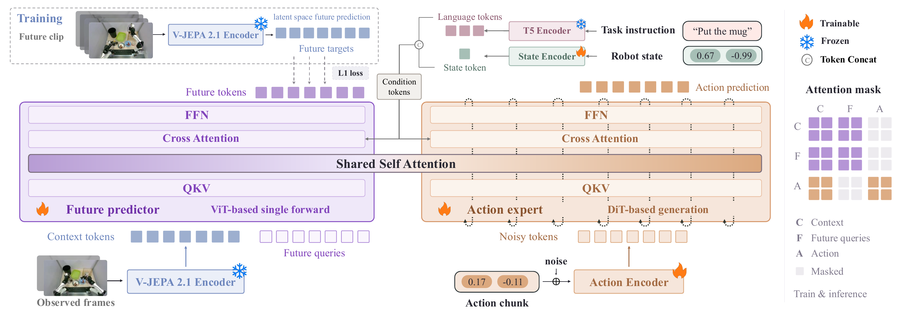
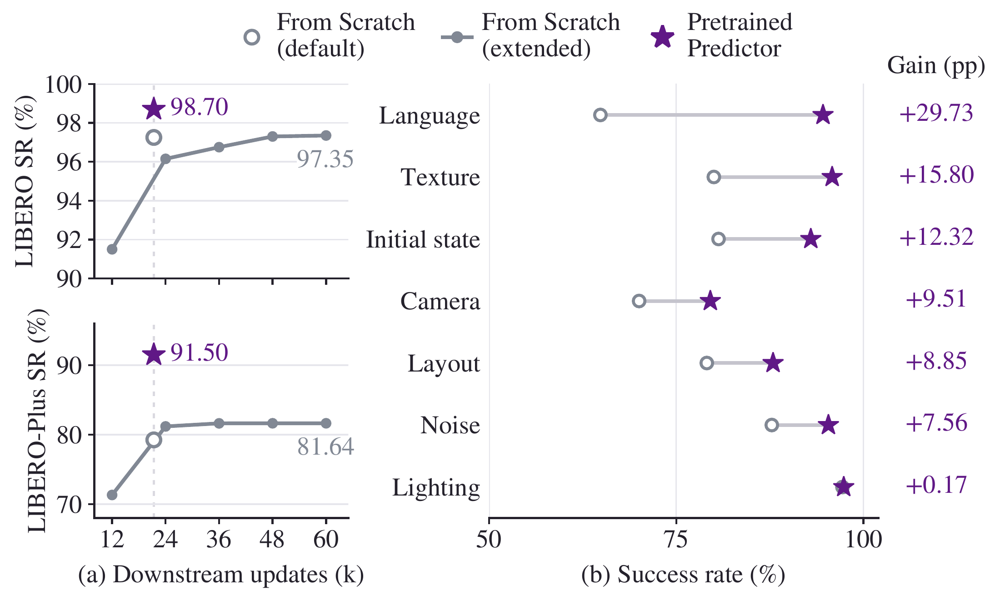

# V-JEPA Policy

<p align="center">
  <strong>Building Effective World-Action Models on Predictive Visual Latents</strong>
</p>

<p align="center">
  <a href="https://github.com/breez3young/VJEPA-Policy/blob/release/LICENSE"></a>
  <a href="https://www.python.org/downloads/release/python-3100/"></a>
  <a href="https://arxiv.org/abs/2609.37250"></a>
</p>

V-JEPA Policy builds a world-action model on the predictive latent space of a frozen **V-JEPA 2.1** encoder. An instruction-conditioned future-latent predictor and a flow-matching action expert couple future visual-state prediction with action generation. The predictor's future-informed context key–value states condition the action expert. The default model uses V-JEPA 2.1 ViT-L and a frozen T5-XXL text encoder with cached instruction embeddings.

<p align="center">
  <a href="assets/figures/architecture.pdf">
    
  </a>
</p>

**Architecture.** The future predictor learns from frozen visual targets, while its future-informed context states condition the action expert. Future clips provide supervision during training.

We study two variants:

- **From Scratch:** jointly learn the future predictor and action expert from task-specific demonstrations in a single downstream stage.
- **Pretrained Predictor:** first pretrain only the future predictor on DROID video–instruction pairs, with proprioceptive conditioning and no action labels or action expert. Transfer the predictor weights to downstream joint training with a freshly initialized action expert.

The visual and text encoders remain frozen in both variants.

## Results

| Variant | LIBERO | LIBERO-Plus | RoboCasa-GR1 |
| --- | ---: | ---: | ---: |
| From Scratch | 97.25 | 79.25 | 50.92 |
| Pretrained Predictor | **98.70** | **91.50** | **55.58** |

Success rates (%) from Table 5 of the [paper](https://arxiv.org/abs/2609.37250). The comparison uses the same downstream data, training protocols, and budgets; predictor-only pretraining adds an upstream training stage. LIBERO-Plus evaluates the policies trained on LIBERO without further fine-tuning.

<p align="center">
  <a href="assets/figures/predictor-pretraining.pdf">
    
  </a>
</p>

**Predictor pretraining and transfer (Figure 2).** Left: the pretrained predictor at the default downstream budget compared with an extended From Scratch run. Right: improvements across all seven LIBERO-Plus perturbation axes at the same default downstream budget; gains are in percentage points.

## Checkpoint release plan

Researchers can train models now using the recipes below. We plan to release:

- [ ] LIBERO policy checkpoints.
- [ ] RoboCasa-GR1 policy checkpoints.
- [ ] The future predictor pretrained on DROID.

Checkpoint download links and the accompanying configurations and normalization statistics will be added here when the releases are available.

## Installation

Use a dedicated conda environment with Python 3.10+. The training and benchmark launchers target Linux with NVIDIA GPUs and require Bash 4+ and Linux command-line tools.

```bash
git clone --branch release https://github.com/breez3young/VJEPA-Policy.git
cd VJEPA-Policy
conda create -n vjepa-policy python=3.10 pip -y
conda activate vjepa-policy
python -m pip install --upgrade pip
# Install a PyTorch build appropriate for your CUDA driver first; see Setup.
python -m pip install -e .
python -c 'from vjepa_policy.encoders import encoder_names; print("\n".join(encoder_names()))'
```

The repository contains source and configuration templates. Prepare the encoder weights, training data, text caches, and simulator assets as described in [Setup](docs/setup.md). For checkpoint serving, install `.[serving]`; simulator installation is covered by each benchmark's evaluation guide.

## Training

Training jointly optimizes the future predictor and action expert on downstream demonstrations. **The tutorial below uses LIBERO as an example.** The same training entry point supports other LeRobot datasets and custom dataset adapters; see the [training guide](docs/training.md) and [dataset/encoder contracts](docs/extensions.md).

First, copy the configuration template and set the dataset, encoder, and text-cache paths in your local copy:

```bash
cp configs/libero_vjepa21.env configs/libero_vjepa21.local.env
# Edit configs/libero_vjepa21.local.env before sourcing it.
source configs/libero_vjepa21.local.env
```

[Prepare the dataset and build the instruction cache](docs/training.md#libero), then choose a training variant.

**From Scratch** jointly trains both modules from their random initialization:

```bash
bash scripts/train_vjepa_policy_fresh_packed48.sh
```

For **Pretrained Predictor**, complete [predictor-only pretraining](docs/training.md#predictor-only-pretraining) first, then provide the resulting predictor checkpoint:

```bash
export PREDICTOR_INIT=/path/to/droid/checkpoint_step100000.pt
bash scripts/train_vjepa_policy_droid_init.sh
```

The LIBERO example uses two independent 224px views, 32-step action chunks, global batch 128, and 21,360 downstream updates for either variant. For a short pipeline check, use `MAX_STEPS=20` with a separate `OUTDIR`. Hardware changes, checkpoint resumption, and additional datasets are covered in the [training guide](docs/training.md).

## Evaluation

Evaluation loads a trained policy together with its frozen encoder weights, normalization statistics, and text cache. **Using LIBERO as the example**, prepare its simulator environment and follow [the evaluation guide](examples/libero/README.md):

```bash
cp configs/libero_eval.env configs/libero_eval.local.env
# Edit the paths for the checkpoint and its matching artifacts/environments.
source configs/libero_eval.local.env
export EVAL_DIR="$RUN_DIR/libero_eval_$(date -u +%Y%m%dT%H%M%SZ)"
bash examples/libero/evaluate_policy.sh "$RUN_DIR" "$CHECKPOINT"
```

Use the same evaluation procedure for the From Scratch and Pretrained Predictor variants, selecting each run's checkpoint and matching artifacts. Benchmark setup, protocols, reduced runs, and result interpretation live with their examples:

| Benchmark | Evaluation guide | Paper protocol |
| --- | --- | --- |
| LIBERO | [examples/libero](examples/libero/README.md) | 40 tasks × 50 episodes = 2,000 episodes |
| LIBERO-Plus | [examples/libero_plus](examples/libero_plus/README.md) | 10,030 perturbed tasks, without further fine-tuning |
| RoboCasa-GR1 | [examples/gr1](examples/gr1/README.md) | 24 tasks × 50 episodes = 1,200 episodes |

## Agent skills

[AGENTS.md](AGENTS.md) maps tasks to the skills in [.agents/skills](.agents/skills). They use the same guides and entry points as the tutorials above.

| Skill | Purpose |
| --- | --- |
| `vjepa-policy-training` | Data/cache preparation, predictor-only pretraining, downstream joint training |
| `vjepa-policy-inference` | Resolve a checkpoint's serving contract and check one action request |
| `vjepa-policy-libero-eval` | Four-suite LIBERO scoring and coverage checks |
| `vjepa-policy-libero-plus-eval` | Native LIBERO-Plus setup, prompt caching, rollouts, and coverage checks |
| `vjepa-policy-gr1` | GR-1 preparation, training, and rollout contracts |

For example: “Use vjepa-policy-libero-eval to evaluate this checkpoint with its training statistics and T5 cache.”

## Development checks

[Lightweight checks](docs/development.md) cover evaluation coverage and training launcher contracts without model weights, simulators, or GPUs. The GitHub Actions workflow runs them on Python 3.10 and 3.12. Environment reports are available through `scripts/check_environment.py`; GPU training and benchmark rollouts remain separate checks.

## Repository map

```text
src/vjepa_policy/    encoders, datasets, predictor, action expert, trainer, serving
scripts/            training, DROID caching, GR-1 preparation, environment/result checks
examples/
  libero/           LIBERO serving, rollouts, and evaluation guide
  libero_plus/      native Plus setup, task manifest, text cache, and evaluation
  gr1/              RoboCasa-GR1 serving, rollouts, and evaluation guide
configs/            local configuration templates and shared recipe defaults
tests/              CPU-only evaluation and launcher regression checks
docs/               setup, training, and extension guides
assets/figures/     paper figures for this README (PNG previews and vector PDFs)
.agents/skills/     task-specific instructions for coding agents
```

## Citation

If you find V-JEPA Policy useful for your research, please consider citing:

```bibtex
@misc{zhang2026vjepapolicybuildingeffective,
  title={V-JEPA Policy: Building Effective World-Action Models on Predictive Visual Latents},
  author={Yang Zhang and Jiangyuan Zhao and Chenyou Fan and Jiayu Hu and Xiu Yuan and Chenjia Bai and Xiu Li},
  year={2026},
  eprint={2609.37250},
  archivePrefix={arXiv},
  primaryClass={cs.CV},
  url={https://arxiv.org/abs/2609.37250},
}
```

## License

This repository is released under the [MIT License](LICENSE). Upstream visual encoders, T5 checkpoints, datasets, simulator assets, and evaluation harnesses retain their own licenses and terms.
